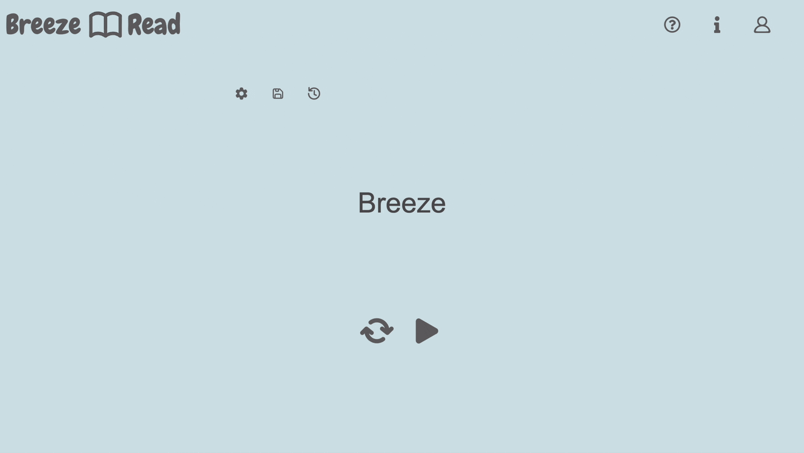

# BreezeRead

A minimalist website for speed reading text using [Rapid Serial Visual Rresentation](https://en.wikipedia.org/wiki/Rapid_serial_visual_presentation).

## Using BreezeRead:

Go to: https://ajdcolvin.github.io/BreezeRead/

Simply copy and paste the block of code you want to speed read into the main text box and hit play!

Various settings can be changed such as WPM (words per minute), pausing for punctuation, and varying pause length for word length. 

You can also login to restore text from a previous session, but this is optional. 